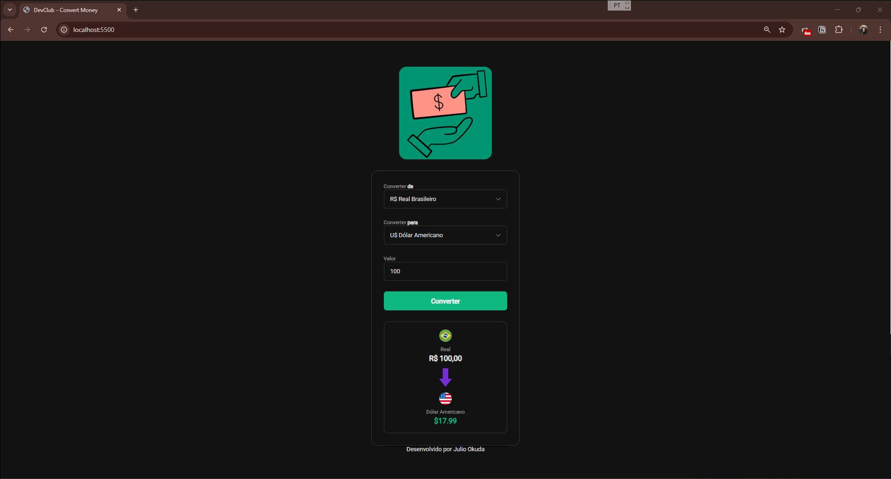

# Convert Money 💰


---


## **🚀[Clique aqui para testar a aplicação em tempo real!](https://jcnok.github.io/Convert-Money/)**

---

### Prévia da Aplicação


*Uma demonstração visual da interface e funcional do conversor.*

---

## 📖 Sobre o Projeto

O **Convert Money** é uma aplicação web intuitiva para a conversão de valores entre diferentes moedas em tempo real. O projeto foi desenvolvido como parte do meu portfólio pessoal para demonstrar habilidades em **HTML5, CSS3 e JavaScript assíncrono**, com foco em criar uma experiência de usuário (UX) limpa, agradável e funcional.

A aplicação consome a API da [AwesomeAPI](https://docs.awesomeapi.com.br/api-de-moedas) para obter as cotações mais recentes, garantindo que os valores exibidos sejam sempre precisos e atualizados.

---

## ✨ Funcionalidades Principais

-   **Conversão em Tempo Real:** Cotações atualizadas via API para conversões precisas.
-   **Múltiplas Moedas:** Suporte para conversão entre Real Brasileiro, Dólar Americano, Euro e Bitcoin.
-   **Interface Bidirecional:** Converta de qualquer moeda para qualquer outra, não apenas a partir de uma moeda base.
-   **Design Moderno e Responsivo:** Interface com tema escuro (Dark Mode), projetada para ser agradável e funcional em qualquer dispositivo.
-   **Usabilidade Inteligente:** A moeda selecionada como origem é automaticamente removida da lista de destino para evitar conversões redundantes.

---

## 🛠️ Tecnologias Utilizadas

Este projeto foi construído com as seguintes tecnologias:

-   **HTML5:** Para a estrutura semântica da página.
-   **CSS3:** Para a estilização moderna, utilizando variáveis, Flexbox e um design responsivo.
-   **JavaScript:** Para toda a lógica de interatividade, incluindo:
    -   **Funções Assíncronas (`async/await`)** para o consumo da API.
    -   **Fetch API** para realizar as requisições HTTP.
    -   **Manipulação do DOM** para atualizar a interface dinamicamente.
    -   **`Intl.NumberFormat`** para formatação correta dos valores monetários.
-   **AwesomeAPI:** Como fonte externa para as cotações de moedas.
-   **GitHub Pages:** Para a hospedagem e demonstração ao vivo do projeto.

---

## 🚀 Como Executar Localmente

Se desejar executar o projeto em sua máquina local, siga os passos abaixo:

1.  **Clone o repositório:**
    ```bash
    git clone https://github.com/Jcnok/Convert-Money.git
    ```

2.  **Navegue até o diretório do projeto:**
    ```bash
    cd Convert-Money
    ```

3.  **Abra o arquivo `index.html` no seu navegador:**
    -   Você pode simplesmente clicar duas vezes no arquivo ou usar uma extensão como o [Live Server](https://marketplace.visualstudio.com/items?itemName=ritwickdey.LiveServer) no VSCode para uma melhor experiência de desenvolvimento.

E pronto! A aplicação estará rodando localmente.

---

## 📄 Licença

Este projeto está sob a licença MIT. Veja o arquivo [LICENSE](https://github.com/Jcnok/Convert-Money/blob/main/LICENSE) para mais detalhes.

---

## 👨‍💻 Desenvolvido por

<table>
  <tr>
    <td align="center">
      <a href="https://github.com/Jcnok">
        <br>
        <sub>
          <b>Julio Okuda</b>
        </sub>
      </a>
    </td>
  </tr>
</table>

**Vamos nos conectar!**
-   **LinkedIn:** [https://linkedin.com/in/juliookuda](https://linkedin.com/in/juliookuda)
-   **GitHub:** [https://github.com/jcnok](https://github.com/jcnok)

